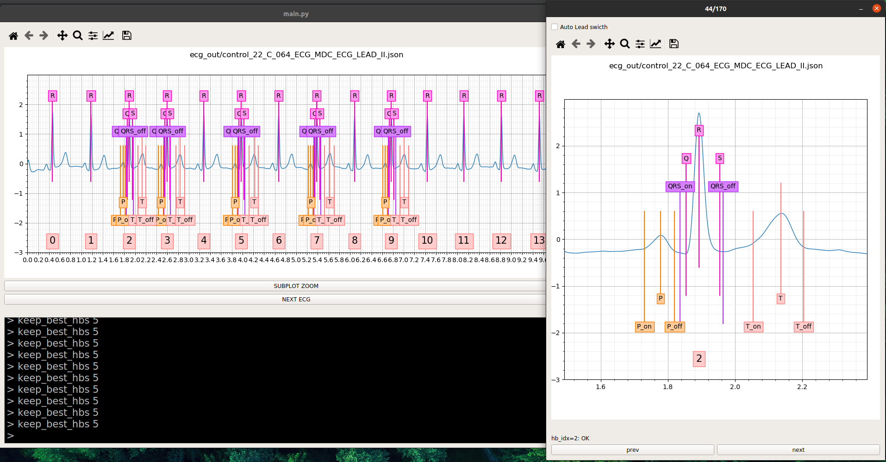

# Python-ECG-Delineator
Python electrocardiography (ECG) signal delineator

The user interface of the software developed for this study is shown in the following figure. The GUI is composed by two windows and allows to both have a global view of the signal and a zoomed view on a specific heartbeat to make the supervision and annotation easier using the mouse pointer. The main window shown on the left contains a very basic console terminal useful to launch commands necessary to manipulate the ECG delineation. Every action performed by the user when she moves the mouse pointer or clicks on a button is translated to a command automatically executed in the terminal. This design choice allows to speed up the development and testing of new functionalities and more importantly make it possible to perform a series of actions automatically by running a series of commands. This opportunity makes easier a possible future improvement where the ECG delineation task is assisted by an artificial intelligence model easily integrable in the Python environment provided by the software structure.



```bash
cd src
python3 main.py
```